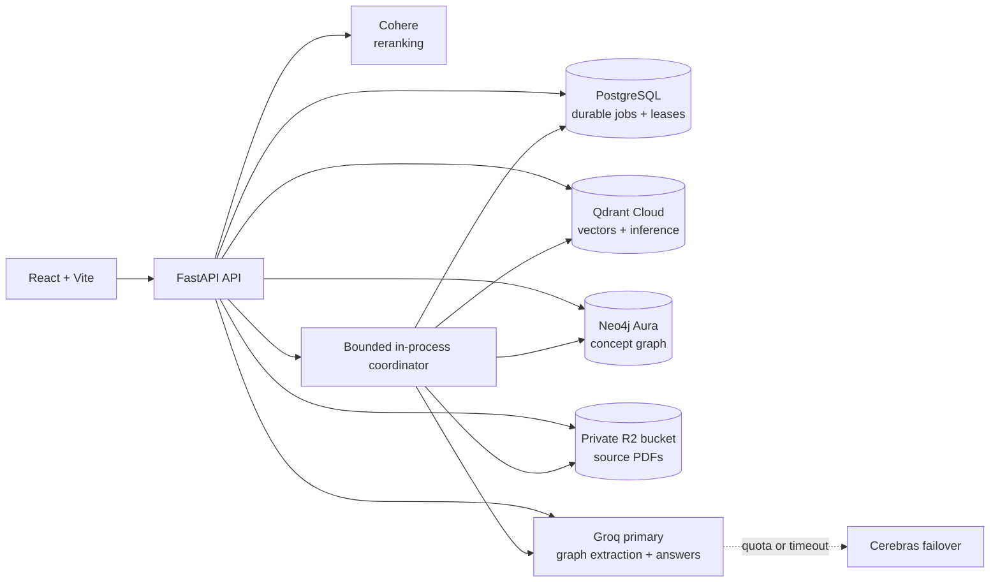

# ConceptGraph Portfolio Edition

ConceptGraph turns course PDFs into a searchable concept graph, grounded answers, and citation-backed mock exams. This portfolio edition keeps the React experience and GraphRAG behavior while running the API and background processor in one bounded, restart-safe FastAPI service. Redis and Celery are not required.


## Architecture



PostgreSQL is authoritative. The in-memory queue is only an execution accelerator: if it is full, a request is saved as `UPLOADED` and the dispatcher picks it up later. If the process stops, its lease expires and startup recovery creates a new, auditable processing attempt. Qdrant, Neo4j, and object storage are derived or external stores; no job state depends on process memory.

## What changed from the distributed edition

- Removed Redis, the Celery app, worker service, broker URLs, and Celery task dispatch.
- Added a lifecycle-managed `asyncio` coordinator with a bounded queue and configurable concurrency (default `1`).
- Added PostgreSQL leases, heartbeats, task-token fencing, durable attempts, startup recovery, and a three-attempt retry cap.
- Preserved the durable stage contract and existing frontend polling/status response.
- Added content-addressed private object storage, duplicate admission control, PDF signature/parse checks, size/count limits, and partial-artifact cleanup.
- Added hosted embedding and reranking modes so the production API does not load Torch.
- Added liveness (`/api/v1/health`) and dependency-aware readiness (`/api/v1/ready`).
- Added strict public-deployment configuration validation and demo access-code protection.

## Durable processing contract

```text
UPLOADED -> EXTRACTING -> EXTRACTED -> CHUNKING -> CHUNKED
-> EMBEDDING -> EMBEDDED -> BUILDING_GRAPH -> GRAPH_BUILT -> READY
```

`READY` is committed only when the source object still exists, every chunk has been stored, graph construction has completed, provenance is present, the graph has an explicit quality status, and the document has a positive chunk count. Graph extraction runs in bounded section batches under a configurable free-tier request budget, retries strict-schema failures once with locally validated JSON, preserves successful batches, and deterministically merges concepts by normalized name. Provider quota exhaustion stops graph calls without discarding searchable vectors or completed graph sections. Incomplete coverage is reported as `GRAPH_PARTIAL`; zero validated concepts is reported as `READY_WITHOUT_GRAPH`. A failed execution removes vectors and graph nodes scoped to that upload/execution before it records `FAILED`.

Graph extraction samples the beginning, middle, and end of each detected PDF section. The application accepts only six relationship types, validates relationship endpoints, deduplicates lowercase whitespace-free concept names, and requires every retained concept to cite a real sampled chunk. Neo4j concepts keep PDF, page, section, and upload provenance; clicking a dashboard concept opens its source page. Groq is the primary LLM, while an optional Cerebras key enables automatic failover for graph extraction, answers, and exams. A shared cooldown temporarily bypasses a provider after a quota response or timeout instead of repeating requests that are expected to fail.

Every worker-owned transition is fenced by both the current task token and lease owner. A stale task cannot advance or complete a newer attempt. The coordinator:

1. claims a dispatchable row with a PostgreSQL row lock;
2. records a lease owner and expiration;
3. extends the lease on the heartbeat interval;
4. runs the shared idempotent processor;
5. releases or clears the lease on completion, failure, or cancellation.

On startup and periodically, expired active rows are recovered. The interrupted attempt is retained as failed, a real new attempt/task token is created, and the document returns to `UPLOADED`. When the retry budget is exhausted it becomes terminally failed with an actionable message.

## Stack

- React 18, TypeScript, Vite, Tailwind CSS, Cytoscape.js
- FastAPI, Uvicorn, SQLAlchemy async, PyMuPDF
- PostgreSQL for durable state, attempts, leases, and canonical course identity
- Qdrant for vectors; Qdrant Cloud Inference in the low-memory profile
- Neo4j for document-provenance-scoped concepts and relationships
- S3-compatible private storage (Cloudflare R2 in production, MinIO locally)
- Groq as the primary provider and Cerebras as the optional quota/timeout failover
- Cohere Rerank for the low-memory hosted profile

## Local development

Requirements: Python 3.12, Node.js, Docker, and a Groq API key. A Cerebras API key is optional but recommended for failover.

```bash
cp .env.example .env
docker compose up -d

python3.12 -m venv .venv
source .venv/bin/activate
pip install -r requirements-local-models.txt
python -m uvicorn app.main:app --host 127.0.0.1 --port 8000
```

In a second terminal:

```bash
npm ci
npm run dev -- --host 127.0.0.1
```

Open `http://127.0.0.1:5173`. Local infrastructure includes PostgreSQL, Qdrant, Neo4j, and MinIO. There is no Redis container and no separate worker command.

For the smaller hosted-provider environment, install `requirements.txt` instead and set:

```dotenv
EMBEDDING_PROVIDER=qdrant_cloud
EMBEDDING_MODEL_NAME=sentence-transformers/all-MiniLM-L6-v2
RERANK_PROVIDER=cohere
RERANK_MODEL_NAME=rerank-v3.5
COHERE_API_KEY=...
```

Gemini remains an optional alternative LLM provider and is installed with `requirements-gemini.txt`.

## Configuration

Copy `.env.example`; it contains every supported setting. Important production settings are:

| Setting | Production value / purpose |
| --- | --- |
| `DATABASE_URL` | External managed PostgreSQL URL; TLS as required by the provider |
| `QDRANT_URL`, `QDRANT_API_KEY` | Qdrant Cloud cluster |
| `EMBEDDING_PROVIDER` | `qdrant_cloud` for a low-memory API |
| `EMBEDDING_MODEL_NAME` | `sentence-transformers/all-MiniLM-L6-v2` (384 dimensions) |
| `RERANK_PROVIDER`, `COHERE_API_KEY` | `cohere` and a secret API key |
| `NEO4J_*` | Neo4j Aura credentials |
| `S3_*` | Private R2 bucket endpoint and scoped credentials |
| `GROQ_API_KEY` | Secret graph/synthesis provider key |
| `CEREBRAS_API_KEY` | Optional secret fallback key; never expose it to Vite or commit it |
| `CEREBRAS_MODEL` | Fallback model; default `gpt-oss-120b` |
| `LLM_FAILOVER_COOLDOWN_SECONDS` | Time to bypass a provider after quota/timeout; default `300` |
| `GRAPH_BATCH_SIZE` | Chunks per graph request; default `4` |
| `GRAPH_MAX_BATCHES` | Maximum graph requests planned per PDF; default `6` for free-tier control |
| `ALLOWED_ORIGINS` | Exact deployed frontend origin; comma-separated if necessary |
| `DEMO_ACCESS_TOKEN` | Secret reviewer code of at least 24 characters; configure it only in the hosting dashboard |
| `REQUIRE_UPLOAD_AUTH` | `true` for public deployments |
| `PUBLIC_SAMPLE_COURSE_ID` | Existing READY course exposed publicly as the read-only sample |
| `DEMO_UPLOAD_RETENTION_DAYS` | Delete reviewer uploads after this many days; default `3` |
| `DEMO_CLEANUP_INTERVAL_SECONDS` | Retention sweep interval; default `21600` (6 hours) |
| `STRICT_STARTUP_VALIDATION` | `true` for public deployments |
| `PROCESSING_CONCURRENCY` | `1` by default; bounded to `1..4` |
| `PROCESSING_QUEUE_CAPACITY` | In-memory admission buffer; durable overflow remains in PostgreSQL |
| `MAX_PDF_SIZE_MB` | Default `10` |
| `MAX_PDFS_PER_INSTALLATION` | Default `50` |

Generate the reviewer code with `openssl rand -base64 32` and save the result directly in the host's secret environment settings. Never paste the actual code into this README, `.env.example`, a commit, or a Vite variable. After login, the dashboard exchanges it for a signed, short-lived HttpOnly cookie and verifies that cookie with the API before enabling protected actions. Rate limiting is intentionally process-local because this deployment runs one API instance. Counters reset on restart and must be replaced by shared infrastructure before scaling horizontally.

The public route exposes only the configured READY sample course and its source-PDF previews. It cannot upload documents, run queries, or generate exams. Uploads made during authenticated reviewer sessions are automatically removed from PostgreSQL, Qdrant, Neo4j, and object storage after the retention window; the configured public sample course is excluded from cleanup. Retention runs only when `REQUIRE_UPLOAD_AUTH=true`.

Never commit `.env`, database URLs, provider keys, bucket credentials, or access tokens. The included example contains placeholders and local-only MinIO credentials.

## Deployment blueprint (not automatically deployed)

`render.yaml` defines one free API service and one static frontend. It deliberately expects an external `DATABASE_URL` instead of creating Render's time-limited free PostgreSQL database. Add the remaining `sync: false` secrets in the Render dashboard before the first start.

Suggested low-cost services:

- Static frontend: Render Static Site or Cloudflare Pages.
- API: Render Free while the measured hosted-provider profile fits; move to paid compute if real traffic or longer processing requires predictable uptime.
- PostgreSQL: an external free managed tier with persistence suitable for your portfolio window.
- Vectors/inference: Qdrant Cloud free cluster.
- Graph: one Neo4j Aura Free instance.
- PDFs: a private Cloudflare R2 bucket with public access disabled.
- LLM/reranking: Groq and Cohere API keys with account-side usage limits.

Current free tiers are not service-level guarantees. Render free web services spin down after inactivity and may restart; that is why processing uses durable leases and recovery. Provider quotas, retention, and prices can change, so verify them before deployment. Useful primary references: [Render free services](https://render.com/docs/free), [Render compute plans](https://render.com/docs/compute-plans), [Qdrant free cluster](https://qdrant.tech/documentation/cloud/create-cluster/), [Qdrant Cloud Inference](https://qdrant.tech/documentation/cloud/inference/), [Neo4j Aura instance creation](https://neo4j.com/docs/aura/getting-started/create-instance/), [Cloudflare R2 pricing](https://developers.cloudflare.com/r2/pricing/), and [Cohere Rerank v2](https://docs.cohere.com/v2/reference/rerank).

### Before deployment

1. Create PostgreSQL, Qdrant, Neo4j, R2, Groq, and Cohere credentials.
2. Create a private R2 bucket; disable public development URLs and use least-privilege object credentials.
3. Set all `sync: false` values in `render.yaml`, including the exact frontend `ALLOWED_ORIGINS` and API `VITE_API_BASE_URL`.
4. Use a new Qdrant collection when changing embedding model or dimension. Startup rejects incompatible existing vectors.
5. Run the verification commands below.
6. Deploy only after explicit approval.

The API image binds on port `8000`, runs as a non-root user, contains no local ML model artifacts, and stores no durable data on the container filesystem.

## Schema changes and rollback

Startup runs additive, idempotent PostgreSQL DDL (`ADD COLUMN IF NOT EXISTS` and `CREATE INDEX IF NOT EXISTS`) before accepting traffic. Back up the database before the first production rollout.

Safe rollout:

1. snapshot/export PostgreSQL;
2. deploy the new API with processing concurrency `1`;
3. wait for `/api/v1/ready`;
4. upload one small PDF and observe it reach `READY`;
5. verify query, citations, concept graph, and exam generation.

Application rollback is safe because the migration is additive. Roll back the service image first; leave the added lease columns/indexes in place. Drop them only during a maintenance window after proving the older image does not depend on them. Do not delete Qdrant collections, graph data, PostgreSQL rows, or R2 objects as part of an application rollback.

Legacy local PDFs can be copied to object storage with a dry-run-first utility:

```bash
python scripts/migrate_pdfs_to_object_storage.py --dry-run
python scripts/migrate_pdfs_to_object_storage.py
```

If PostgreSQL claims a document is ready after a vector migration but its points are missing:

```bash
python scripts/reconcile_ready_vectors.py
python scripts/reconcile_ready_vectors.py --apply
```

## Capacity evidence

Measurements were taken on macOS with Python 3.12 using `resource.getrusage(...).ru_maxrss` after cached model loads:

| Probe | Measured peak resident memory |
| --- | ---: |
| Import API after removing eager model imports | ~193 MiB |
| Production container API import (Linux) | ~187 MiB |
| Local MiniLM embedding load + encode 8 strings | ~553 MiB |
| Local embedding + cross-encoder rerank | ~599 MiB |

The verified production image is about 140 MiB (147,140,460 bytes). The local model profile is not safe for a 512 MiB process. The Render blueprint uses hosted embedding/reranking and excludes Torch/SentenceTransformers from the production requirements. These are engineering measurements, not hosting guarantees; repeat them in the target container and use paid memory if real PDF processing approaches the limit.

The queue is intentionally conservative: one processor, eight buffered jobs, 10 MiB PDFs, and 50 PDFs per installation. Increasing concurrency multiplies parse buffers and provider traffic and should be backed by a new load/memory test.

## Small retrieval evaluation

The repository includes a deliberately small, human-annotated baseline rather than a large evaluation framework. [`evaluation/questions.json`](evaluation/questions.json) contains 15 questions for the READY `CYBER` course: 10 answerable questions with manually checked PDF pages and concepts, plus 5 out-of-scope questions that should be refused.

Measured on 30 August 2026 against the configured local pipeline and persistent portfolio stores:

| Metric | Result |
| --- | ---: |
| Correct document in top 5 | 8/10 |
| Correct source page in top 5 | 8/10 |
| Answers with inline citations | 6/10 |
| Unsupported questions refused | 5/5 |
| Average query time | 7.58s |

The complete per-question result is committed in [`evaluation/baseline-2026-08-30.json`](evaluation/baseline-2026-08-30.json). The latency includes a 25-second first-query model cold start; subsequent queries were faster. The baseline had zero request errors after graph context was bounded for the provider prompt. Two answerable questions were conservatively refused, and two otherwise grounded answers omitted an inline citation label. Those misses are kept visible instead of being edited out.

Run the same direct evaluation against the stores and providers configured in `.env`:

```bash
python scripts/run_evaluation.py \
  --direct \
  --output evaluation/baseline-local.json
```

To measure the deployed HTTP path, set `EVAL_API_BASE_URL` and keep `DEMO_ACCESS_TOKEN` in the environment or uncommitted `.env`; the runner never accepts or prints the reviewer code as a command-line argument:

```bash
EVAL_API_BASE_URL=https://your-api.example/api/v1 \
  python scripts/run_evaluation.py --output evaluation/baseline-hosted.json
```

This baseline measures only document/page retrieval in the top five citation sources, inline citation presence, evidence-based refusal, and end-to-end query latency. Expected concepts remain annotation notes and are not turned into a subjective answer-quality score.

## Verification

```bash
source .venv/bin/activate
python -m compileall -q app tests
python -m unittest discover -s tests -v
npm ci
npm run build
docker compose config -q
```

Tests focus on system boundaries and failure behavior: durable stage transitions, leases, fencing, expired-attempt recovery, bounded queue behavior, deferred admission, retry exhaustion, idempotent cleanup, READY deletion, demo retention, empty graphs, relationship validation, provider timeouts/rate limits, scanned PDFs without text, READY gating, graph sampling and provenance, hosted inference/reranking, object storage, PDF byte ranges and citation links, verified auth sessions, public sample isolation, evidence refusal, and readiness-sensitive course behavior.

## API surface

- `GET /api/v1/health` — PostgreSQL liveness
- `GET /api/v1/ready` — PostgreSQL, Qdrant, Neo4j, object storage, and coordinator readiness
- `POST|GET|DELETE /api/v1/auth/session`
- `GET /api/v1/public/sample` — rate-limited read-only sample graph
- `GET /api/v1/public/sample/uploads/{upload_id}/preview` — sample-only PDF preview
- `POST /api/v1/ingest/upload`
- `GET /api/v1/ingest/status/{task_id}`
- `GET /api/v1/ingest/uploads`
- `GET /api/v1/ingest/courses`
- `POST /api/v1/ingest/uploads/{upload_id}/retry`
- `GET /api/v1/ingest/uploads/{upload_id}/preview`
- `DELETE /api/v1/ingest/uploads/{upload_id}` (READY or FAILED documents only)
- `POST /api/v1/query`
- `POST /api/v1/exam/generate`

## Repository safety

This clone is configured with the new portfolio repository as `origin`. The source repository is `upstream` for fetches only and has its push URL disabled. Do not change that protection or push portfolio changes to the original repository.
