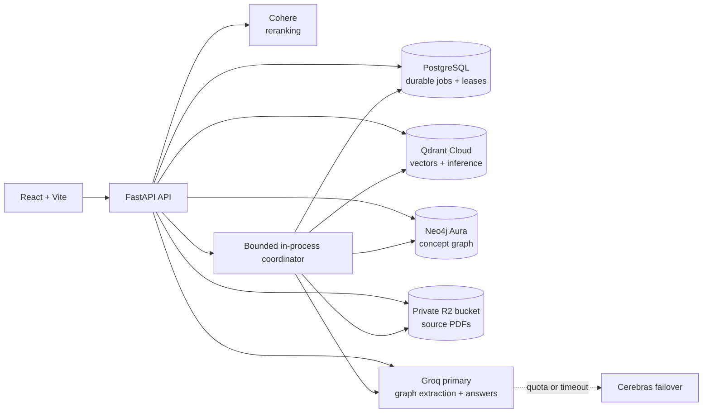
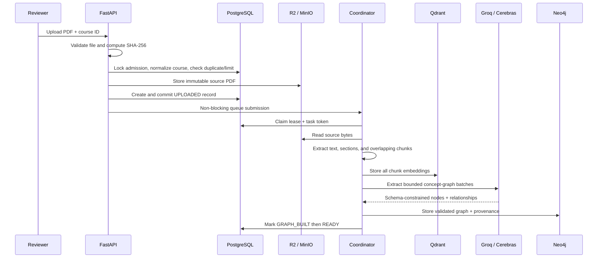
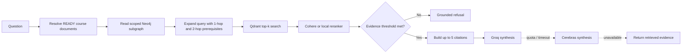

# ConceptGraph Portfolio Edition

ConceptGraph turns course PDFs into a searchable concept graph, grounded answers, and citation-backed mock exams. This portfolio edition keeps the React experience and GraphRAG behavior while running the API and background processor in one bounded, restart-safe FastAPI service. Redis and Celery are not required.

[Live demo](https://conceptgraph-frontend.onrender.com/) · [Source code](https://github.com/Ninjax26/conceptgraph-portfolio) · [API health](https://conceptgraph-api.onrender.com/api/v1/health) · [API readiness](https://conceptgraph-api.onrender.com/api/v1/ready) · [CI](https://github.com/Ninjax26/conceptgraph-portfolio/actions/workflows/ci.yml) · [Engineering handbook](ENGINEERING_HANDBOOK.md)

> Portfolio scope: this is a controlled, shared reviewer demo—not a multi-tenant SaaS. Public visitors can inspect one pre-uploaded read-only course. A reviewer access code protects uploads and paid AI operations.


## Documentation guide

- Start with [What the project demonstrates](#what-the-project-demonstrates) and [Current implementation status](#current-implementation-status) for a portfolio overview.
- Read [End-to-end processes](#end-to-end-processes) for the complete upload, GraphRAG, exam, recovery, authentication, and cleanup flows.
- Use [Local development](#local-development), [Configuration](#configuration), and [Deployment](#deployment) to run or host it.
- Review [Small retrieval evaluation](#small-retrieval-evaluation) and [Verification](#verification) for evidence that the system works.
- Prepare with the [Interview guide](#interview-guide), then use the [Engineering handbook](ENGINEERING_HANDBOOK.md) for deeper invariants.

## What the project demonstrates

- A complete PDF-to-GraphRAG pipeline, not only an LLM chat screen.
- Polyglot persistence with a clear owner for each kind of data.
- Durable background processing on a small single-service deployment.
- Evidence gating, citations, source-page provenance, and honest empty/partial graph states.
- Provider quota resilience with Groq-to-Cerebras failover and grounded degradation.
- Data lifecycle management: retry, retention, full deletion, and partial-write compensation.
- Measured retrieval results and failure-focused tests instead of an unverified “it works” claim.

## Current implementation status

| Area | Implemented behavior |
| --- | --- |
| Dashboard presentation | Non-overlapping protected-session bar, answers directly under questions, Markdown answer rendering, clearer confidence/citation cards, collapsible processing details, responsive graph layout |
| PDF ingestion | Type/signature/size/password checks, SHA-256 deduplication, private content-addressed object storage, durable upload record before background dispatch |
| Processing reliability | Bounded in-process queue, PostgreSQL leases, heartbeats, task-token fencing, startup recovery, three-attempt cap, safe public error categories |
| Graph quality | Section-aware beginning/middle/end sampling, bounded multi-batch extraction, six allowed relationship types, endpoint validation, normalized concept deduplication, partial/empty graph detection |
| Provenance | Upload ID, PDF filename, page, section, and source chunk retained on graph concepts; graph nodes open the original source page |
| Retrieval and answers | READY-only course filtering, graph-assisted Qdrant retrieval, Cohere/local reranking, evidence thresholds, grounded refusal, citations, formatted answers |
| LLM resilience | Groq primary, optional Cerebras failover for graphs/answers/exams, five-minute circuit-breaker cooldown, evidence-only answer fallback |
| Demo security | One reviewer code, signed expiring HttpOnly session cookie, post-login session verification, exact CORS configuration, protected expensive routes, rate limits |
| Public access | One pre-uploaded read-only sample course and source previews without exposing upload/query/exam controls |
| Data cleanup | Manual deletion across PostgreSQL, Qdrant, Neo4j, and R2; automatic demo retention; sample-course exclusion; shared-object protection |
| Evaluation | Fifteen manually annotated questions, committed baseline results, top-five document/page checks, citation/refusal checks, latency measurement |
| Verification | 100 backend tests plus Python compilation, TypeScript checking, Vite production build, Docker Compose validation, and GitHub Actions |
| Scanned PDFs | Detected and rejected with an OCR-required message; OCR itself is intentionally listed as future work |

The commit history records these improvements as separate, explainable phases: dashboard polish, answer formatting, cross-site sessions, complete deletion, demo hardening/public sample/retention, evaluation, graph quality and provenance, complex-PDF batching, quota-safe degradation, and Cerebras failover.

## Architecture



PostgreSQL is authoritative. The in-memory queue is only an execution accelerator: if it is full, a request is saved as `UPLOADED` and the dispatcher picks it up later. If the process stops, its lease expires and startup recovery creates a new, auditable processing attempt. Qdrant, Neo4j, and object storage are derived or external stores; no job state depends on process memory.

### Why each datastore exists

| Store | Responsibility | Why it is not interchangeable |
| --- | --- | --- |
| PostgreSQL | Courses, uploads, stages, attempts, leases, counts, failure state | Transactional source of truth and recovery authority |
| Qdrant | Chunk embeddings and metadata-filtered semantic retrieval | Efficient similarity search over PDF passages |
| Neo4j | Concepts, typed relationships, and source provenance | Natural traversal and visualization of prerequisite/part-of structure |
| R2/MinIO | Immutable private source PDFs | Durable binary storage independent of Render's ephemeral filesystem |

This is deliberate polyglot persistence: every derived Qdrant point and Neo4j entity can be rebuilt from the PostgreSQL record plus the source PDF.

## End-to-end processes

### 1. Upload and document processing



Important behavior:

1. The API validates the extension, MIME type, configured 10 MiB limit, `%PDF-` signature, readability, page count, and password state.
2. It takes a PostgreSQL advisory transaction lock, normalizes the course name, checks the `(course, SHA-256)` duplicate, and enforces the installation limit.
3. The source object uses `courses/{course_uuid}/documents/{sha256}.pdf`; the durable database row is committed before queue submission.
4. A worker claims the row with a lease and task token. Every state transition must still match both values, preventing a stale worker from completing a newer retry.
5. PyMuPDF extracts the text layer. Text is split by detected headings, then into roughly 500-word chunks with 50-word overlap. Page, section, filename, upload, and execution metadata travel with every chunk.
6. Every chunk must reach Qdrant before the graph stage starts. If no text exists, the PDF fails with an OCR-required message and no partial derived data remains.
7. Graph extraction runs with a bounded request budget. Successful batches are preserved, validated, merged, and written to Neo4j.
8. `READY` is permitted only after the source still exists, all vectors are committed, graph construction has an explicit quality result, and counts are positive.

### 2. Graph construction for complex PDFs

The graph pipeline intentionally avoids a complicated agent system:

1. Group chunks by detected section or page fallback.
2. Sample the beginning, middle, and end of each section.
3. Select batches fairly across the document (`4` chunks per batch, up to `6` batches by default).
4. Ask for no more than `8` concepts and `10` relationships per batch.
5. Attempt strict JSON Schema, then one smaller JSON-object compatibility request.
6. Validate every node, endpoint, relationship type, and source-chunk reference locally.
7. Normalize concept identity using lowercase plus whitespace removal and deterministically merge batches.
8. Record section/batch coverage so the UI can distinguish complete, partial, and missing graphs.

Allowed relationships are `PREREQUISITE_OF`, `PART_OF`, `EXPLAINS`, `RELATED_TO`, `CAUSES`, and `APPLIES_TO`.

Graph status is separate from document readiness:

- `GRAPH_READY`: at least two retained concepts and one valid relationship with acceptable coverage.
- `GRAPH_PARTIAL`: useful concepts exist, but graph density or section coverage is incomplete.
- `READY_WITHOUT_GRAPH`: chunks are searchable, but no valid concepts survived validation.

### 3. Question-answering flow



Only READY upload IDs can contribute results. Retrieval uses deterministic, parameterized, read-only Cypher; it does not execute an LLM-generated database query. A matched concept is the anchor: inbound `PREREQUISITE_OF` paths are traversed to a maximum depth of two, direct and foundational prerequisites are kept separate, and both groups expand the semantic query. The traversal is course- and upload-scoped, cycle-safe, and bounded to five anchors. If no concept name matches, Qdrant receives the original question unchanged so a broad graph fallback cannot dilute vector retrieval. Qdrant then performs metadata-filtered semantic search, and reranking produces a provider-neutral score. Evidence confidence combines `70%` reranker probability with `30%` vector similarity. If nothing passes the minimum threshold, the API refuses before calling an LLM.

The dashboard distinguishes query anchors, direct prerequisites, and two-hop foundational prerequisites. The API also reports both hop counts in `graph_metadata.graph_expansion`; two-hop prerequisite edges use a dashed style so retrieval depth remains visible rather than being implied.

The answer prompt contains only bounded graph context and retrieved course passages. Citations expose readable PDF/page/section information and preview links, never internal vector IDs, storage keys, or database identifiers.

### 4. Exam generation

The exam service retrieves chunks only from the selected READY course, balances source passages across available documents, and asks for a strict JSON multiple-choice exam. Each question must have four options, an answer copied exactly from those options, an explanation, a topic, and at least one valid source ID. Questions with invented or missing citations are discarded. Groq-to-Cerebras failover uses the same cooldown policy as graph extraction and answer synthesis.

### 5. Retry, crash recovery, and compensation

- Queue saturation leaves the PostgreSQL row in `UPLOADED`; it is deferred, not falsely failed.
- Workers heartbeat while synchronous parsing and provider calls run in threads.
- On restart, expired leases become auditable failed attempts and receive a new task token when retry budget remains.
- Manual and automatic recovery share the global three-attempt maximum.
- Before every execution, old Qdrant/Neo4j artifacts for that upload are removed, making retries idempotent.
- A failed execution removes partial vectors and graph entities before recording its safe failure category.

### 6. Authentication, public sample, and data sharing

This deployment uses one reviewer code, not individual accounts. The code is exchanged for a signed, expiring HttpOnly cookie; the frontend verifies that session with a second API request before unlocking protected controls. Everyone using the same reviewer session sees the same shared courses and uploads because there is no user or tenant column. This is intentional and is stated in the UI as **Shared portfolio demo**.

Unauthenticated visitors can only load the configured public sample and its source previews. They cannot upload, query the AI, generate exams, retry, or delete. Standard, login, public-sample, and expensive operations have separate process-local rate limits.

### 7. Deletion and automatic retention

READY or FAILED uploads can be deleted. Cleanup is ordered to avoid orphaned user data:

1. delete Qdrant points scoped to `upload_id`;
2. delete Neo4j concepts/relationships scoped to the upload and remove an orphaned course node;
3. delete the source object only when no retained record references the same content-addressed key;
4. delete PostgreSQL attempt/upload metadata and remove an empty course row.

Active documents cannot be deleted while a worker may own them. In protected-demo mode, the same deletion path automatically removes old reviewer uploads after the configured retention period; the public sample course is excluded.

## What changed from the distributed edition

- Removed Redis, the Celery app, worker service, broker URLs, and Celery task dispatch.
- Added a lifecycle-managed `asyncio` coordinator with a bounded queue and configurable concurrency (default `1`).
- Added PostgreSQL leases, heartbeats, task-token fencing, durable attempts, startup recovery, and a three-attempt retry cap.
- Preserved the durable stage contract and existing frontend polling/status response.
- Added content-addressed private object storage, duplicate admission control, PDF signature/parse checks, size/count limits, and partial-artifact cleanup.
- Added hosted embedding and reranking modes so the production API does not load Torch.
- Added liveness (`/api/v1/health`) and dependency-aware readiness (`/api/v1/ready`).
- Added strict public-deployment configuration validation and demo access-code protection.

## Durable processing contract

```text
UPLOADED -> EXTRACTING -> EXTRACTED -> CHUNKING -> CHUNKED
-> EMBEDDING -> EMBEDDED -> BUILDING_GRAPH -> GRAPH_BUILT -> READY
```

`READY` is committed only when the source object still exists, every chunk has been stored, graph construction has completed, provenance is present, the graph has an explicit quality status, and the document has a positive chunk count. Graph extraction runs in bounded section batches under a configurable free-tier request budget, retries strict-schema failures once with locally validated JSON, preserves successful batches, and deterministically merges concepts by normalized name. Provider quota exhaustion stops graph calls without discarding searchable vectors or completed graph sections. Incomplete coverage is reported as `GRAPH_PARTIAL`; zero validated concepts is reported as `READY_WITHOUT_GRAPH`. A failed execution removes vectors and graph nodes scoped to that upload/execution before it records `FAILED`.

Graph extraction samples the beginning, middle, and end of each detected PDF section. The application accepts only six relationship types, validates relationship endpoints, deduplicates lowercase whitespace-free concept names, and requires every retained concept to cite a real sampled chunk. Neo4j concepts keep PDF, page, section, and upload provenance; clicking a dashboard concept opens its source page. At query time, Neo4j contributes separate bounded one-hop and two-hop prerequisite sets to semantic retrieval while retaining all valid relationship types for visualization. Groq is the primary LLM, while an optional Cerebras key enables automatic failover for graph extraction, answers, and exams. A shared cooldown temporarily bypasses a provider after a quota response or timeout instead of repeating requests that are expected to fail.

Every worker-owned transition is fenced by both the current task token and lease owner. A stale task cannot advance or complete a newer attempt. The coordinator:

1. claims a dispatchable row with a PostgreSQL row lock;
2. records a lease owner and expiration;
3. extends the lease on the heartbeat interval;
4. runs the shared idempotent processor;
5. releases or clears the lease on completion, failure, or cancellation.

On startup and periodically, expired active rows are recovered. The interrupted attempt is retained as failed, a real new attempt/task token is created, and the document returns to `UPLOADED`. When the retry budget is exhausted it becomes terminally failed with an actionable message.

## Stack

- React 18, TypeScript, Vite, Tailwind CSS, Cytoscape.js
- FastAPI, Uvicorn, SQLAlchemy async, PyMuPDF
- PostgreSQL for durable state, attempts, leases, and canonical course identity
- Qdrant for vectors; Qdrant Cloud Inference in the low-memory profile
- Neo4j for document-provenance-scoped concepts and relationships
- S3-compatible private storage (Cloudflare R2 in production, MinIO locally)
- Groq as the primary provider and Cerebras as the optional quota/timeout failover
- Cohere Rerank for the low-memory hosted profile

## Local development

Requirements: Python 3.12, Node.js, Docker, and at least one configured LLM provider. The deployed profile uses Groq as primary and Cerebras as optional failover.

```bash
cp .env.example .env
docker compose up -d

python3.12 -m venv .venv
source .venv/bin/activate
pip install -r requirements-local-models.txt
python -m uvicorn app.main:app --host 127.0.0.1 --port 8000
```

In a second terminal:

```bash
npm ci
npm run dev -- --host 127.0.0.1
```

Open `http://127.0.0.1:5173`. Local infrastructure includes PostgreSQL, Qdrant, Neo4j, and MinIO. There is no Redis container and no separate worker command.

For the smaller hosted-provider environment, install `requirements.txt` instead and set:

```dotenv
EMBEDDING_PROVIDER=qdrant_cloud
EMBEDDING_MODEL_NAME=sentence-transformers/all-MiniLM-L6-v2
RERANK_PROVIDER=cohere
RERANK_MODEL_NAME=rerank-v3.5
COHERE_API_KEY=...
```

Gemini remains an optional alternative LLM provider and is installed with `requirements-gemini.txt`.

## Configuration

Copy `.env.example`; it contains every supported setting. Important production settings are:

| Setting | Production value / purpose |
| --- | --- |
| `DATABASE_URL` | External managed PostgreSQL URL; TLS as required by the provider |
| `QDRANT_URL`, `QDRANT_API_KEY` | Qdrant Cloud cluster |
| `EMBEDDING_PROVIDER` | `qdrant_cloud` for a low-memory API |
| `EMBEDDING_MODEL_NAME` | `sentence-transformers/all-MiniLM-L6-v2` (384 dimensions) |
| `RERANK_PROVIDER`, `COHERE_API_KEY` | `cohere` and a secret API key |
| `NEO4J_*` | Neo4j Aura credentials |
| `S3_*` | Private R2 bucket endpoint and scoped credentials |
| `LLM_PROVIDER` | `groq` for the deployed primary/failover route; `cerebras` and `gemini` are supported direct alternatives |
| `GROQ_API_KEY` | Secret graph/synthesis provider key |
| `CEREBRAS_API_KEY` | Optional secret fallback key; never expose it to Vite or commit it |
| `CEREBRAS_MODEL` | Fallback model; default `gpt-oss-120b` |
| `CEREBRAS_BASE_URL` | OpenAI-compatible API base; default `https://api.cerebras.ai/v1` |
| `LLM_FAILOVER_COOLDOWN_SECONDS` | Time to bypass a provider after quota/timeout; default `300` |
| `GRAPH_BATCH_SIZE` | Chunks per graph request; default `4` |
| `GRAPH_MAX_BATCHES` | Maximum graph requests planned per PDF; default `6` for free-tier control |
| `ALLOWED_ORIGINS` | Exact deployed frontend origin; comma-separated if necessary |
| `DEMO_ACCESS_TOKEN` | Secret reviewer code of at least 24 characters; configure it only in the hosting dashboard |
| `REQUIRE_UPLOAD_AUTH` | `true` for public deployments |
| `PUBLIC_SAMPLE_COURSE_ID` | Existing READY course exposed publicly as the read-only sample |
| `DEMO_UPLOAD_RETENTION_DAYS` | Delete reviewer uploads after this many days; default `3` |
| `DEMO_CLEANUP_INTERVAL_SECONDS` | Retention sweep interval; default `21600` (6 hours) |
| `STRICT_STARTUP_VALIDATION` | `true` for public deployments |
| `PROCESSING_CONCURRENCY` | `1` by default; bounded to `1..4` |
| `PROCESSING_QUEUE_CAPACITY` | In-memory admission buffer; durable overflow remains in PostgreSQL |
| `MAX_PDF_SIZE_MB` | Default `10` |
| `MAX_PDFS_PER_INSTALLATION` | Default `50` |

Generate the reviewer code with `openssl rand -base64 32` and save the result directly in the host's secret environment settings. Never paste the actual code into this README, `.env.example`, a commit, or a Vite variable. After login, the dashboard exchanges it for a signed, short-lived HttpOnly cookie and verifies that cookie with the API before enabling protected actions. Rate limiting is intentionally process-local because this deployment runs one API instance. Counters reset on restart and must be replaced by shared infrastructure before scaling horizontally.

The public route exposes only the configured READY sample course and its source-PDF previews. It cannot upload documents, run queries, or generate exams. Uploads made during authenticated reviewer sessions are automatically removed from PostgreSQL, Qdrant, Neo4j, and object storage after the retention window; the configured public sample course is excluded from cleanup. Retention runs only when `REQUIRE_UPLOAD_AUTH=true`.

Never commit `.env`, database URLs, provider keys, bucket credentials, or access tokens. The included example contains placeholders and local-only MinIO credentials.

## Deployment

The project is currently deployed from the separate portfolio repository: [frontend](https://conceptgraph-frontend.onrender.com/), [API health](https://conceptgraph-api.onrender.com/api/v1/health), and [API readiness](https://conceptgraph-api.onrender.com/api/v1/ready). `render.yaml` defines one free API service and one static frontend. It deliberately expects an external `DATABASE_URL` instead of creating Render's time-limited free PostgreSQL database. Add every `sync: false` secret in the Render dashboard; Git pushes trigger normal service builds after the Blueprint has been configured.

Current low-cost deployment:

- Static frontend: [Render Static Site](https://render.com/docs/static-sites).
- API: [Render Free web service](https://render.com/docs/free) while the measured hosted-provider profile fits; move to paid compute if real traffic or longer processing requires predictable uptime.
- PostgreSQL: an external free managed tier with persistence suitable for your portfolio window.
- Vectors/inference: [Qdrant Cloud free cluster](https://qdrant.tech/documentation/cloud/create-cluster/) with [Cloud Inference](https://qdrant.tech/documentation/cloud/inference/).
- Graph: one [Neo4j AuraDB](https://neo4j.com/docs/aura/getting-started/create-instance/) Free instance.
- PDFs: a private [Cloudflare R2](https://developers.cloudflare.com/r2/) bucket using its [S3-compatible API](https://developers.cloudflare.com/r2/api/), with public access disabled.
- LLM/reranking: [Groq](https://console.groq.com/docs/overview) primary, [Cerebras Chat Completions](https://inference-docs.cerebras.ai/api-reference/chat-completions) failover, and [Cohere Rerank](https://docs.cohere.com/v2/reference/rerank), each with account-side limits.

Current free tiers are not service-level guarantees. Render free web services spin down after inactivity and use an ephemeral filesystem; that is why source PDFs live in R2 and processing uses durable leases/recovery. Provider quotas, retention rules, and prices can change, so verify them before deployment. See [Render compute plans](https://render.com/docs/compute-plans) and [Cloudflare R2 pricing](https://developers.cloudflare.com/r2/pricing/) for current limits.

### Before deployment

1. Create PostgreSQL, Qdrant, Neo4j, R2, Groq, and Cohere credentials; create Cerebras credentials when failover is desired.
2. Create a private R2 bucket; disable public development URLs and use least-privilege object credentials.
3. Set all `sync: false` values in `render.yaml`, including the exact frontend `ALLOWED_ORIGINS` and API `VITE_API_BASE_URL`.
4. Use a new Qdrant collection when changing embedding model or dimension. Startup rejects incompatible existing vectors.
5. Run the verification commands below.
6. Deploy after the verification suite succeeds and the secret inventory has been checked.

The API image binds on port `8000`, runs as a non-root user, contains no local ML model artifacts, and stores no durable data on the container filesystem.

For Cerebras failover, keep `LLM_PROVIDER=groq` and add `CEREBRAS_API_KEY` only to the API service environment. Never add it to the static frontend or any `VITE_*` variable. `CEREBRAS_MODEL`, `CEREBRAS_BASE_URL`, and the cooldown have safe defaults in both the application and Blueprint.

## Schema changes and rollback

Startup runs additive, idempotent PostgreSQL DDL (`ADD COLUMN IF NOT EXISTS` and `CREATE INDEX IF NOT EXISTS`) before accepting traffic. Back up the database before the first production rollout.

Safe rollout:

1. snapshot/export PostgreSQL;
2. deploy the new API with processing concurrency `1`;
3. wait for `/api/v1/ready`;
4. upload one small PDF and observe it reach `READY`;
5. verify query, citations, concept graph, and exam generation.

Application rollback is safe because the migration is additive. Roll back the service image first; leave the added lease columns/indexes in place. Drop them only during a maintenance window after proving the older image does not depend on them. Do not delete Qdrant collections, graph data, PostgreSQL rows, or R2 objects as part of an application rollback.

Legacy local PDFs can be copied to object storage with a dry-run-first utility:

```bash
python scripts/migrate_pdfs_to_object_storage.py --dry-run
python scripts/migrate_pdfs_to_object_storage.py
```

If PostgreSQL claims a document is ready after a vector migration but its points are missing:

```bash
python scripts/reconcile_ready_vectors.py
python scripts/reconcile_ready_vectors.py --apply
```

## Capacity evidence

Measurements were taken on macOS with Python 3.12 using `resource.getrusage(...).ru_maxrss` after cached model loads:

| Probe | Measured peak resident memory |
| --- | ---: |
| Import API after removing eager model imports | ~193 MiB |
| Production container API import (Linux) | ~187 MiB |
| Local MiniLM embedding load + encode 8 strings | ~553 MiB |
| Local embedding + cross-encoder rerank | ~599 MiB |

The verified production image is about 140 MiB (147,140,460 bytes). The local model profile is not safe for a 512 MiB process. The Render blueprint uses hosted embedding/reranking and excludes Torch/SentenceTransformers from the production requirements. These are engineering measurements, not hosting guarantees; repeat them in the target container and use paid memory if real PDF processing approaches the limit.

The queue is intentionally conservative: one processor, eight buffered jobs, 10 MiB PDFs, and 50 PDFs per installation. Increasing concurrency multiplies parse buffers and provider traffic and should be backed by a new load/memory test.

## Small retrieval evaluation

The repository includes a deliberately small, human-annotated baseline rather than a large evaluation framework. [`evaluation/questions.json`](evaluation/questions.json) contains 15 questions for the READY `CYBER` course: 10 answerable questions with manually checked PDF pages and concepts, plus 5 out-of-scope questions that should be refused.

Measured on 30 August 2026 against the configured local pipeline and persistent portfolio stores:

| Metric | Result |
| --- | ---: |
| Correct document in top 5 | 8/10 |
| Correct source page in top 5 | 8/10 |
| Answers with inline citations | 6/10 |
| Unsupported questions refused | 5/5 |
| Average query time | 7.58s |

The complete per-question result is committed in [`evaluation/baseline-2026-08-30.json`](evaluation/baseline-2026-08-30.json). The latency includes a 25-second first-query model cold start; subsequent queries were faster. The baseline had zero request errors after graph context was bounded for the provider prompt. Two answerable questions were conservatively refused, and two otherwise grounded answers omitted an inline citation label. Those misses are kept visible instead of being edited out.

Run the same direct evaluation against the stores and providers configured in `.env`:

```bash
python scripts/run_evaluation.py \
  --direct \
  --output evaluation/baseline-local.json
```

To measure the deployed HTTP path, set `EVAL_API_BASE_URL` and keep `DEMO_ACCESS_TOKEN` in the environment or uncommitted `.env`; the runner never accepts or prints the reviewer code as a command-line argument:

```bash
EVAL_API_BASE_URL=https://your-api.example/api/v1 \
  python scripts/run_evaluation.py --output evaluation/baseline-hosted.json
```

This baseline measures only document/page retrieval in the top five citation sources, inline citation presence, evidence-based refusal, and end-to-end query latency. Expected concepts remain annotation notes and are not turned into a subjective answer-quality score.

## Repository map

| Path | Purpose |
| --- | --- |
| `src/pages/Dashboard.tsx` | Main protected workspace, upload queue, answers, citations, graph status, deletion/retry controls |
| `src/components/ConceptGraphCanvas.tsx` | Cytoscape graph rendering and source-node interaction |
| `src/components/DemoAccessGate.tsx` | Reviewer-code exchange and server-verified session gate |
| `src/components/PublicSampleCourse.tsx` | Read-only public graph and PDF source preview |
| `app/api/endpoints/` | FastAPI auth, upload/status, public sample, query, and exam boundaries |
| `app/core/processing_coordinator.py` | Bounded queue, dispatcher, lease claims, worker lifecycle, restart recovery |
| `app/services/document_processing_service.py` | Durable stage orchestration and failure compensation |
| `app/services/parser_service.py` | PyMuPDF text extraction, heading detection, and overlapping chunks |
| `app/services/ingestion_service.py` | Qdrant writes, graph batching/validation/merge, Neo4j provenance, cleanup |
| `app/services/rag_service.py` | READY-scoped graph and vector retrieval |
| `app/services/rerank_service.py` | Local/Cohere provider-neutral reranking |
| `app/services/synthesis_service.py` | Evidence-bounded answers and provider degradation |
| `app/services/cerebras_service.py` | OpenAI-compatible Cerebras client and normalized provider errors |
| `app/services/provider_failover.py` | Thread-safe provider cooldown circuit breaker |
| `app/services/exam_service.py` | Citation-validated course MCQ generation |
| `app/services/upload_service.py` | Durable records, attempts, leases, retries, completion gates, deletion metadata |
| `ENGINEERING_HANDBOOK.md` | Runtime invariants and safe-change rules |
| `evaluation/` and `scripts/run_evaluation.py` | Human-labelled dataset, baseline, and repeatable evaluation runner |
| `render.yaml` | API/static-site Blueprint and secret placeholders |

## Known limitations and honest roadmap

These are intentional portfolio boundaries, not hidden claims:

- **No OCR yet.** Image-only PDFs are detected and rejected. A practical next step is page rendering plus OCR only when native text density is below a threshold, retaining page coordinates and marking OCR-derived evidence.
- **Shared data model.** One reviewer code grants access to one shared workspace. Real multi-user support needs user identities, tenant ownership on every PostgreSQL row, Qdrant payload, Neo4j entity, and object key, plus authorization checks on every query and cleanup path.
- **Process-local rate limits and circuit breaker.** They match the single Render API instance. Horizontal scaling needs Redis or another shared coordination store.
- **Single bounded worker by default.** This protects memory and free provider quotas but limits throughput. Scale only after measuring parse memory, provider budgets, and database connection pools.
- **Small evaluation set.** Fifteen questions are enough to demonstrate measurement, not to claim general academic QA quality. Expand across subjects, layouts, scanned PDFs, and adversarial unsupported questions.
- **Graph entity resolution is deliberately simple.** Lowercase/whitespace normalization is explainable but will not merge synonyms or disambiguate homonyms. More advanced entity resolution belongs after a labelled graph-quality benchmark exists.
- **Free-tier cold starts and quotas.** The demo can be slow after inactivity and no free provider offers a production SLA. Durable recovery and failover reduce impact but cannot create capacity that every provider has exhausted.
- **No collaborative isolation or audit identity.** Attempts are auditable at the processing level, but actions are not attributed to individual people.

Recommended next phases, in order:

1. OCR fallback with page-level provenance and OCR-confidence reporting.
2. Expand the labelled evaluation dataset and run it in CI against deterministic fixtures.
3. Add provider metrics: selected provider, fallback count, latency, quota errors, and per-operation token use without logging prompts or keys.
4. Add real authentication and tenant-scoped storage only if the project becomes a shared product.
5. Move workers/rate limits to shared infrastructure only when traffic justifies the extra operational complexity.

## Interview guide

### 30-second introduction

> “ConceptGraph is a full-stack GraphRAG portfolio project. A reviewer uploads a course PDF, and a durable FastAPI pipeline extracts page-aware chunks, stores vectors in Qdrant, builds a validated concept graph in Neo4j, and keeps processing state in PostgreSQL. Questions combine graph context with semantic retrieval, reranking, evidence thresholds, and source-page citations. I focused on reliability and explainability: partial graphs are reported honestly, failed writes are cleaned up, processing recovers after restarts, and Cerebras automatically handles Groq quota or timeout failures.”

### Two-minute walkthrough

1. **Admission:** validate the PDF, hash it, deduplicate it, store it privately, and commit an `UPLOADED` PostgreSQL row.
2. **Durability:** submit to a bounded queue, but treat PostgreSQL—not memory—as the job authority. A worker must acquire a lease and use the current task token.
3. **Document representation:** extract the native text layer, detect headings, create overlapping page-aware chunks, and embed every chunk in Qdrant.
4. **Graph construction:** sample each section across its beginning/middle/end, run a bounded number of structured LLM calls, validate locally, and store only permitted nodes/edges with provenance in Neo4j.
5. **Quality state:** mark the document `GRAPH_READY`, `GRAPH_PARTIAL`, or `READY_WITHOUT_GRAPH` instead of pretending every LLM output is complete.
6. **Retrieval:** scope to READY uploads, match graph anchors, traverse bounded one-hop and two-hop prerequisites, expand the vector query with separately labelled terms, rerank, and reject weak evidence. If no anchor matches, preserve vector-only retrieval by searching the original question.
7. **Answer:** synthesize only from selected evidence, attach PDF/page citations, fail over from Groq to Cerebras, and return evidence directly if both LLMs are unavailable.
8. **Lifecycle:** support retry, crash recovery, timed demo retention, and complete deletion across every datastore.

### Design decisions to emphasize

- **PostgreSQL is the source of truth.** The queue can disappear without losing the job.
- **Derived data is provenance-scoped.** Qdrant and Neo4j artifacts can be deleted or rebuilt by upload.
- **The graph is optional enrichment.** An empty graph does not destroy useful vector retrieval.
- **LLM output is untrusted input.** Schema, relationship, endpoint, size, source, and quality checks run before persistence.
- **Reliability is proportional to the project.** A bounded in-process coordinator is simpler and cheaper than Redis/Celery while leases preserve restart safety.
- **Security claims match the deployment.** It is called a shared portfolio demo, not incomplete multi-user authentication.
- **Results are measured honestly.** The baseline includes misses and refusals instead of manually improving the reported numbers.

### Common interview questions and model answers

#### 1. What problem does this solve?

Students often have long course PDFs but no structured view of how topics relate. The project converts those PDFs into searchable evidence and a concept map, then answers questions and creates exams only from the uploaded material.

#### 2. Why use both Qdrant and Neo4j?

Qdrant answers “which passages are semantically similar to this question?” Neo4j answers “which concepts are connected and how?” Vector search finds evidence; the graph adds explicit structure such as prerequisites and part-of relationships. Query retrieval follows inbound prerequisites for at most two hops, while the dashboard visually separates the matched concept, direct prerequisites, and foundational prerequisites. PostgreSQL still owns workflow state, so neither derived store is treated as authoritative.

#### 3. Why not store everything in one database?

It is possible, but each selected store has a clear strength. The important design choice is not the number of databases—it is defining ownership, provenance, cleanup, and rebuild behavior. For a smaller product I would reconsider this complexity based on measured needs.

#### 4. Why remove Celery and Redis?

The target was a free, single-instance portfolio deployment. Running more services increased cost and operational failure modes. I replaced them with a bounded `asyncio` coordinator, while PostgreSQL leases and attempts preserve the properties that matter: durability, exclusive ownership, retries, and restart recovery.

#### 5. What happens if the API crashes during processing?

The in-memory item disappears, but its PostgreSQL record remains. The lease eventually expires; startup/periodic recovery marks the interrupted attempt, creates a new task token when retries remain, resets the document to `UPLOADED`, and queues it again. Provenance-scoped cleanup makes re-execution idempotent.

#### 6. How do you prevent two workers from processing the same PDF?

Claiming uses a PostgreSQL row lock plus lease ownership. Every later transition includes upload ID, task token, and lease owner. If a stale worker continues after a retry, its update no longer matches and is rejected.

#### 7. How do you prevent duplicate uploads?

The API computes SHA-256, normalizes the course identity, takes an advisory transaction lock, and rejects an existing `(course, content hash)` record before admission. Content-addressed storage also avoids arbitrary duplicate object names.

#### 8. How do you handle complicated PDFs?

I do not send an entire PDF in one prompt. I preserve page/section metadata, sample the beginning, middle, and end of sections, distribute a six-batch default budget fairly, validate each response, and merge successful batches. That improves coverage while keeping quota and context bounded.

#### 9. Why can graph generation still be partial?

Some sections may contain tables, weak headings, very little conceptual text, malformed provider output, or provider failures. Reporting `GRAPH_PARTIAL` is more responsible than claiming success. The document remains searchable through its committed vectors.

#### 10. How do you reduce hallucinations?

Retrieval is restricted to READY documents in the chosen course. Reranked evidence must pass a configured threshold before synthesis. The prompt forbids outside knowledge, citations are built from retrieved metadata, insufficient evidence is refused, and graph output is validated before storage. This reduces hallucination risk but does not claim to eliminate it.

#### 11. How are citations explainable?

Every chunk keeps filename, page, section, upload ID, and source chunk ID. Graph concepts inherit provenance from real sampled chunks. Answers expose up to five readable source cards, and both citations and graph nodes can open the PDF at the relevant page.

#### 12. What caused the “AI provider is busy” bug, and how did you fix it?

The logs showed a Groq daily-token 429. Retrying the same provider could not create quota, so I first bounded graph prompts/batches and preserved partial work. Then I added Cerebras failover with a shared five-minute cooldown. Graphs, answers, and exams switch provider after quota, timeout, connection, or server failures; answers still degrade to retrieved evidence if both providers are unavailable.

#### 13. Why a circuit breaker instead of retrying immediately?

A quota or outage is likely to affect the next request too. The cooldown avoids repeated latency and token-limit failures across later batches and user requests. After the cooldown, the primary is tried again automatically.

#### 14. How is multi-user access handled?

It is not a multi-tenant system. The reviewer code produces signed stateless sessions, but all reviewers share the same workspace and data. Public users only see one read-only sample. For real users I would introduce identity and tenant ownership consistently across all four stores—not only add a login screen.

#### 15. How do you delete a PDF safely?

Only READY or FAILED documents are eligible. I delete upload-scoped Qdrant and Neo4j artifacts first, then the source object when it is not shared, then PostgreSQL metadata. Active documents are protected, and orphaned course records/nodes are removed only after the final document disappears.

#### 16. What tests were most valuable?

Boundary and failure tests: stale-worker fencing, expired lease recovery, queue saturation, partial-write cleanup, provider rate limits/timeouts, invalid graph endpoints/types, empty graphs, scanned PDFs, auth session verification, citation links, public sample isolation, full deletion, and retention. These protect behavior, not internal implementation details.

#### 17. How did you evaluate the RAG system?

I created fifteen manually checked questions with expected documents/pages and unsupported cases. The runner measures top-five document/page retrieval, inline citations, refusal behavior, and latency. The committed baseline is small and imperfect, which makes it credible and gives a concrete improvement target.

#### 18. What would you improve next?

OCR with provenance is first because it unlocks scanned course material. Then I would expand evaluation and add provider/latency observability. Multi-user auth and distributed workers come later, only if usage requires them.

#### 19. What is the main bottleneck?

On the free deployment, external provider quota and cold-start latency are more limiting than local CPU. Graph extraction makes several structured LLM calls, while Qdrant, Neo4j, PostgreSQL, R2, Cohere, and the LLM providers all add network latency. Bounded concurrency prevents one PDF burst from exhausting memory or quotas.

#### 20. What trade-off are you most comfortable defending?

Keeping graph enrichment non-blocking for document usefulness. A PDF with valid chunks should remain searchable even if no trustworthy graph can be built. That choice makes the product more available while exposing graph quality honestly.

## Verification

Latest repository verification: **100 backend tests passing**, production frontend build passing, and GitHub Actions passing.

```bash
source .venv/bin/activate
python -m compileall -q app tests
python -m unittest discover -s tests -v
npm ci
npm run build
docker compose config -q
```

Tests focus on system boundaries and failure behavior: durable stage transitions, leases, fencing, expired-attempt recovery, bounded queue behavior, deferred admission, retry exhaustion, idempotent cleanup, READY deletion, demo retention, empty graphs, relationship validation, provider timeouts/rate limits, Cerebras request compatibility and circuit-breaker failover, scanned PDFs without text, READY gating, graph sampling and provenance, hosted inference/reranking, object storage, PDF byte ranges and citation links, verified auth sessions, public sample isolation, evidence refusal, and readiness-sensitive course behavior.

## API surface

- `GET /api/v1/health` — PostgreSQL liveness
- `GET /api/v1/ready` — PostgreSQL, Qdrant, Neo4j, object storage, and coordinator readiness
- `POST|GET|DELETE /api/v1/auth/session`
- `GET /api/v1/public/sample` — rate-limited read-only sample graph
- `GET /api/v1/public/sample/uploads/{upload_id}/preview` — sample-only PDF preview
- `POST /api/v1/ingest/upload`
- `GET /api/v1/ingest/status/{task_id}`
- `GET /api/v1/ingest/uploads`
- `GET /api/v1/ingest/courses`
- `POST /api/v1/ingest/uploads/{upload_id}/retry`
- `GET /api/v1/ingest/uploads/{upload_id}/preview`
- `DELETE /api/v1/ingest/uploads/{upload_id}` (READY or FAILED documents only)
- `POST /api/v1/query`
- `POST /api/v1/exam/generate`

## Repository safety

This portfolio edition was developed from the [original ConceptGraph repository](https://github.com/Ninjax26/conceptgraph). The separate [portfolio repository](https://github.com/Ninjax26/conceptgraph-portfolio) is configured as `origin`. The source repository remains `upstream` for fetches only and its push URL is disabled, preventing portfolio changes from being pushed back to the original repository accidentally.
